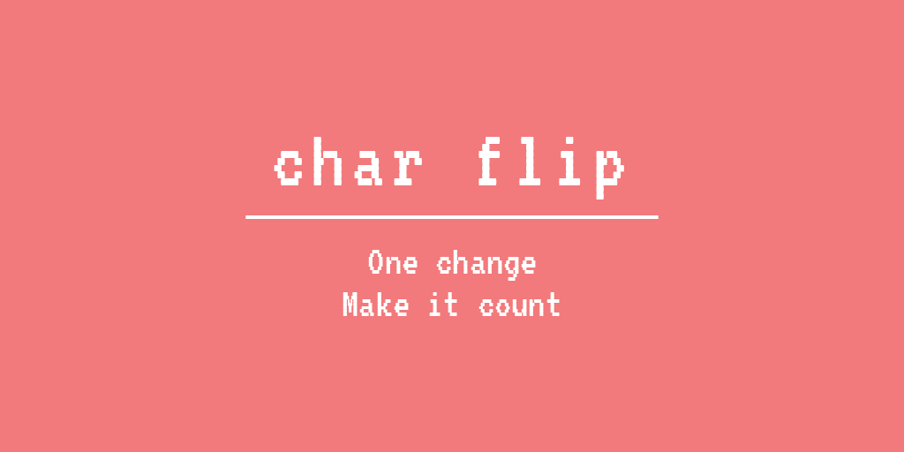
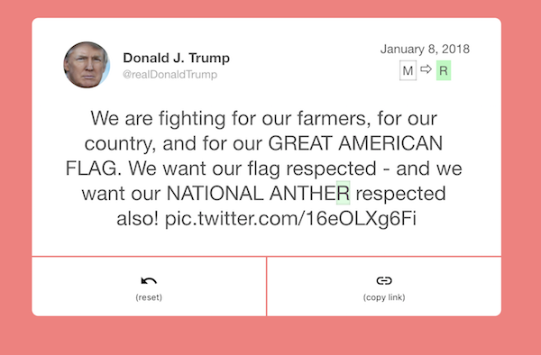
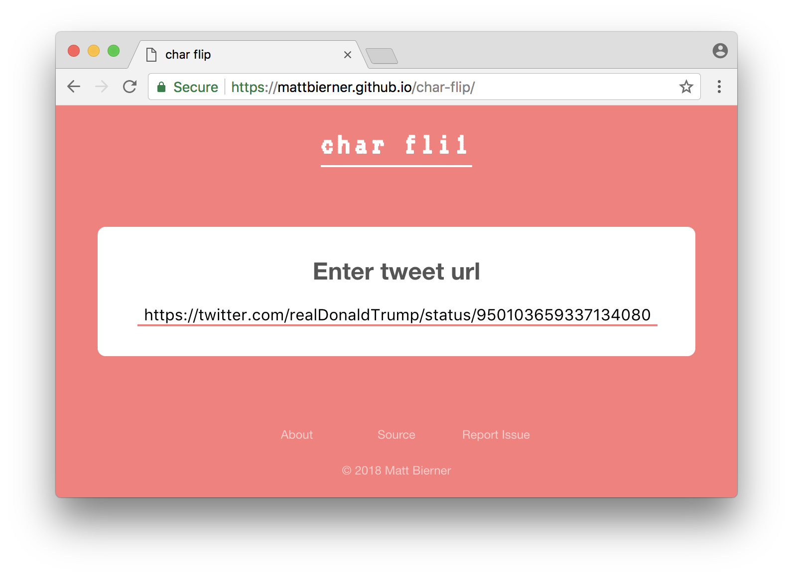

<div align='center'>
    
</div>


# About
*char-flip* is experiment that lets you flip a single character in a tweet. The right flip can have entertaining results.




# Usage
To get started, head over to [the site](https://mattbierner.github.io/char-flip/) and paste in the url of any tweet:




Click on the tweet text to place the cursor and move about like in a standard text editor. You can only change a single character at a time:

> **💡 Tip**: You can insert Emoji and other symbols as well


The current cursor position is outlined in gray. The currently changed character is highlighted in green.

> **💡 Tip**: Use space to 'erase' a character or cleverly split a word

After making your flip, share your work using the current page url.
 You can[Let me know](https://twitter.com/mattbierner/) what you create


# Building
The site uses typescript and webpack. To build:

```bash
npm install
npm run compile:watch
```

Main code is located the `src` directory and output to `dist`
