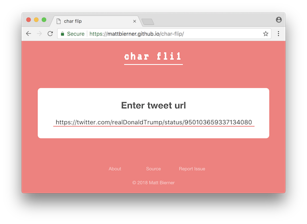

<div align='center'>
    
</div>


# About
*char-flip* is experiment that lets you flip a single character in a tweet. With the right flip, the result can be highly entertaining.


# Usage
To get started, head over to [the site](https://mattbierner.github.io/char-flip/) and paste in the url of any tweet:




Click on the tweet text to place the cursor and move about like in a standard text editor. You can only change a single character at a time. The the current cursor position is outlined. Currently changed character is highlighted in green:


After making your change, share your work with the current page url


# Building
The site uses typescript and webpack. To build:

```bash
npm install
npm run compile:watch
```

Main code is located the `src` directory and output to `dist`
